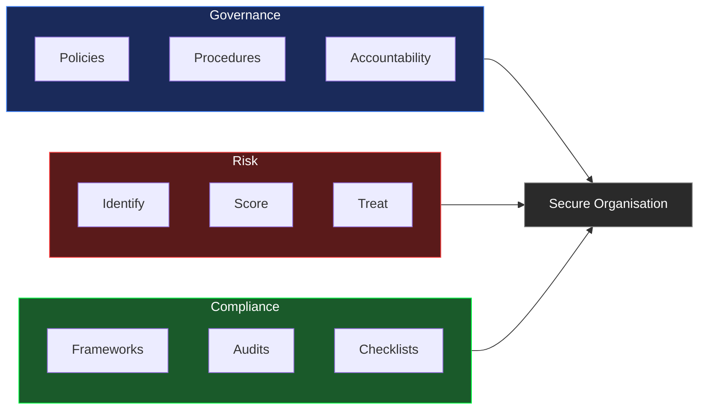
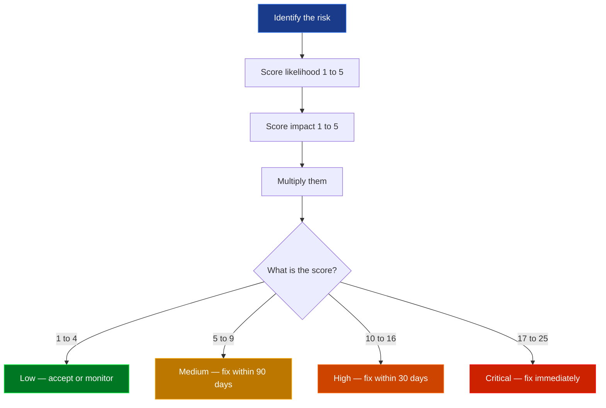
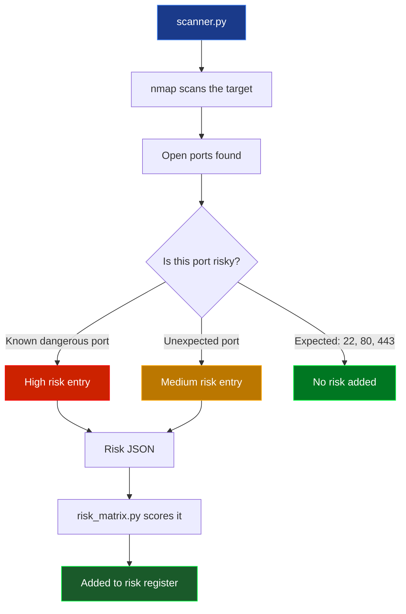
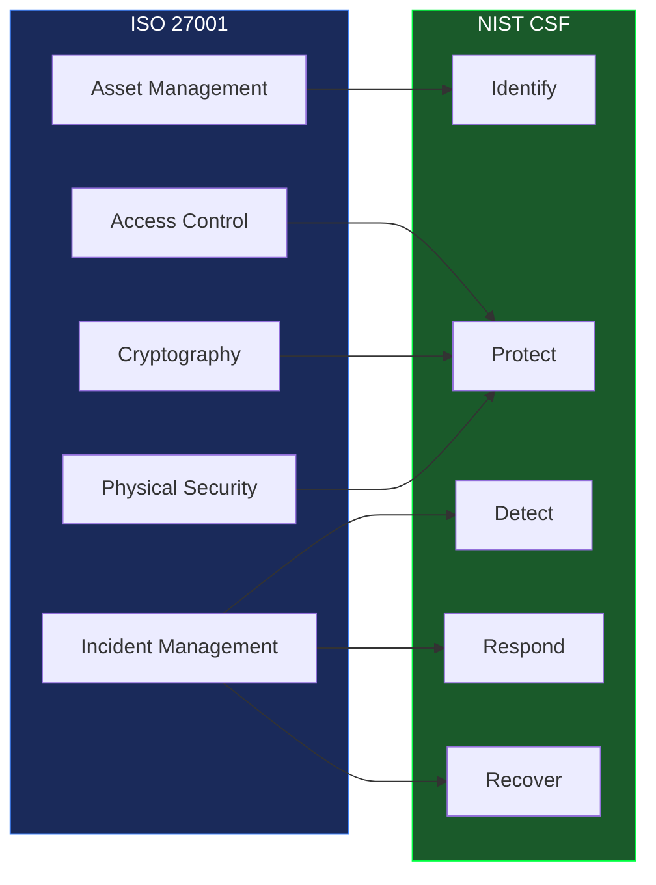
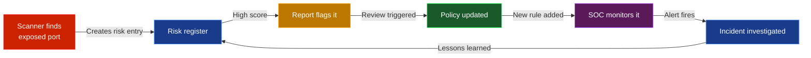

<div align="center">


<br/>


</div>

---

## What this is

GRC stands for Governance, Risk and Compliance. It is the part of security work that most students do not learn about until they are in a real job — and then suddenly it is everywhere.

While a SOC analyst is responding to live incidents, a GRC analyst is asking harder questions: do we actually know what our risks are? Does our network match what our policy says it should? Are the controls we think are in place actually working?

This project builds those tools from scratch. Risk scoring, network scanning, compliance checking and automated reporting — all in Python, all with tests.

---

## What is GRC

The three parts fit together like this:



**Governance** is about setting the rules — who is responsible, what the policies say, and making sure people follow them.

**Risk** is about knowing what could go wrong. You identify threats, score them by likelihood and impact, then decide what to do about each one.

**Compliance** is about proving your controls actually exist and work. Not just having a policy that says "we encrypt sensitive data" — but being able to show that you do.

---

## Risk scoring

The scoring model is simple: `likelihood × impact`. Both run from 1 to 5. The result sits between 1 and 25.



Running it against the sample register:

```
Risk Assessment Report
======================================================================
ID         Risk                            Score   Level      Owner
----------------------------------------------------------------------
RISK-002   Phishing attack                  20     Critical   Security Team
RISK-001   Unpatched systems                20     Critical   IT Operations
RISK-005   SQL injection data breach        15     High       Dev Team
RISK-003   Insider threat                   10     High       HR / Security
RISK-004   DDoS attack                       9     Medium     Network Team
RISK-006   Lost or stolen laptop             6     Medium     IT Operations
```

---

## Network scanning

One of the most useful things a GRC analyst does is check whether the network actually matches what the security policy says it should. The scanner handles this — it runs nmap against a target, finds open ports and converts each risky one into a risk register entry automatically.

> Only scan hosts you own or have written permission to test.



Ports that trigger a High risk entry automatically:

```
21    FTP         sends credentials in plaintext
23    Telnet      everything unencrypted
25    SMTP        open relay risk
445   SMB         WannaCry and most ransomware used this
3389  RDP         constant brute force target
3306  MySQL       databases should never be public
5432  PostgreSQL  same as MySQL
6379  Redis       often runs with no authentication
27017 MongoDB     countless breaches from exposed instances
8080  HTTP Alt    dev servers without TLS
```

Example output when a risky port is found:

```
Network Scan Report
Target  : localhost
============================================================
Open ports: 22 (ssh), 80 (http), 443 (https), 3306 (mysql 8.0.32)

Risks identified: 1

  NET-3306 — MySQL exposed on port 3306
    Reason   : Database should not be publicly accessible
    Score    : 16 → High
    Treatment: Restrict with firewall rules or close the port
```

---

## Compliance

The checklist maps to ISO 27001 and NIST CSF. These are the two frameworks you will see most often in real GRC roles.

**ISO 27001** is the international standard for information security management. Getting certified means an external auditor verified your controls are real and working.

**NIST CSF** organises security into five functions: Identify, Protect, Detect, Respond, Recover. It is widely used in the US and increasingly everywhere else.



---

## How GRC and SOC connect

These two do not work in isolation. The SOC responds to threats in real time. GRC makes sure the controls that should prevent those threats actually exist.



When the scanner finds a database exposed to the internet, it goes into the risk register. That triggers a policy review. The SOC gets a new detection rule. When that rule fires, the findings feed back into the risk register. One loop.

---

## Weekly reports

A report is generated automatically every Monday, Wednesday and Friday. It saves to `reports/YYYY-MM-DD/README.md` and includes charts for compliance score per area and open risks by severity.

All previous reports are in [`reports/`](./reports/README.md).

---

## Project structure

```
grc-project/
├── grc/
│   ├── risk-assessment/
│   │   ├── risk_matrix.py       ← likelihood × impact scoring
│   │   └── sample_risks.json    ← example risk register
│   ├── network-scan/
│   │   └── scanner.py           ← nmap wrapper with risk output
│   ├── policies/
│   │   └── security_policy.md  ← policy template
│   └── compliance/
│       └── checklist.md        ← ISO 27001 / NIST CSF checklist
├── scripts/
│   └── generate_report.py      ← weekly report generator
├── reports/
├── tests/
│   ├── test_risk_matrix.py     ← 8 tests
│   └── test_scanner.py         ← 5 tests
└── .github/workflows/
    ├── tests.yml
    └── weekly-report.yml
```

---

## Quickstart

```bash
git clone https://github.com/Speed-boo3/grc-project.git
cd grc-project
pip install -r requirements.txt
```

Score risks from the sample register:
```bash
python grc/risk-assessment/risk_matrix.py --file grc/risk-assessment/sample_risks.json
```

Scan for network exposure:
```bash
python grc/network-scan/scanner.py --target localhost --output network_risks.json
python grc/risk-assessment/risk_matrix.py --file network_risks.json
```

Generate a report:
```bash
python scripts/generate_report.py
```

Run the tests:
```bash
pytest tests/ -v
```

---

## Test your knowledge

20 questions covering GRC fundamentals. Built for students learning this from scratch.

<div align="center">

[](https://speed-boo3.github.io/grc-project/quiz/)

</div>

---

## Learn more

- [ISO 27001](https://www.iso.org/isoiec-27001-information-security.html) — the international security management standard
- [NIST CSF](https://www.nist.gov/cyberframework) — the five-function security lifecycle
- [NIST SP 800-30](https://csrc.nist.gov/publications/detail/sp/800-30/rev-1/final) — risk assessment guide
- [CIS Controls](https://www.cisecurity.org/controls) — prioritised security best practices

---

The SOC side of this project is in [soc-project](https://github.com/Speed-boo3/soc-project).

<div align="center">

</div>
