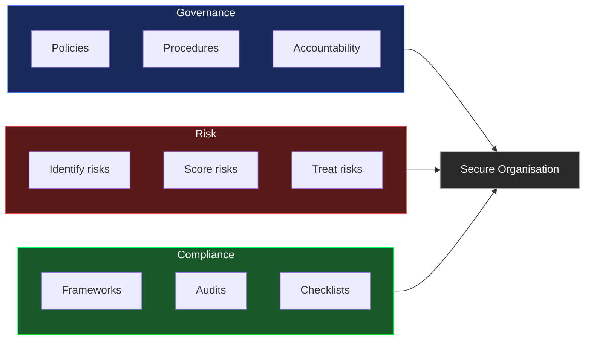
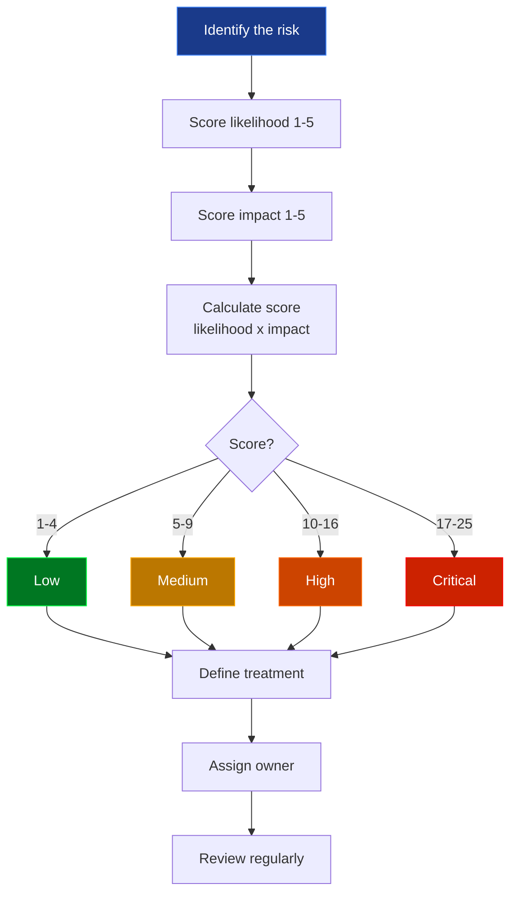
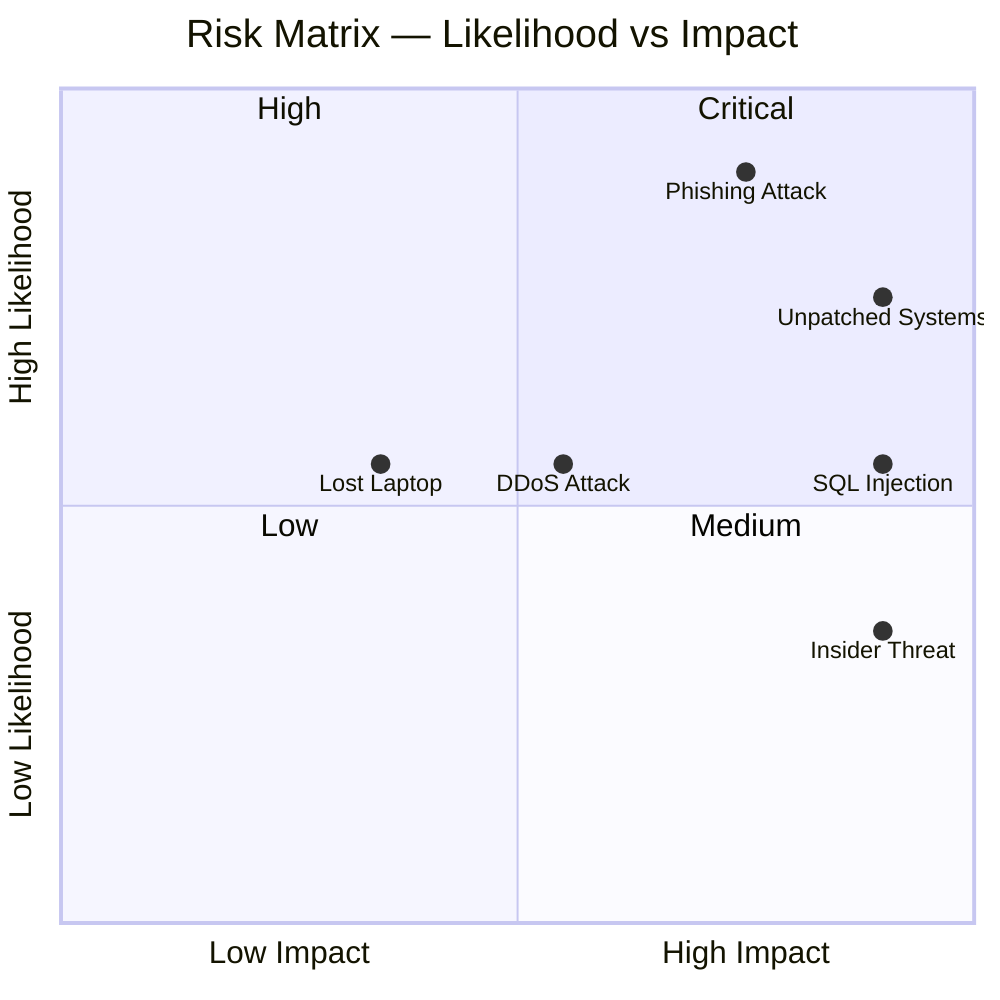
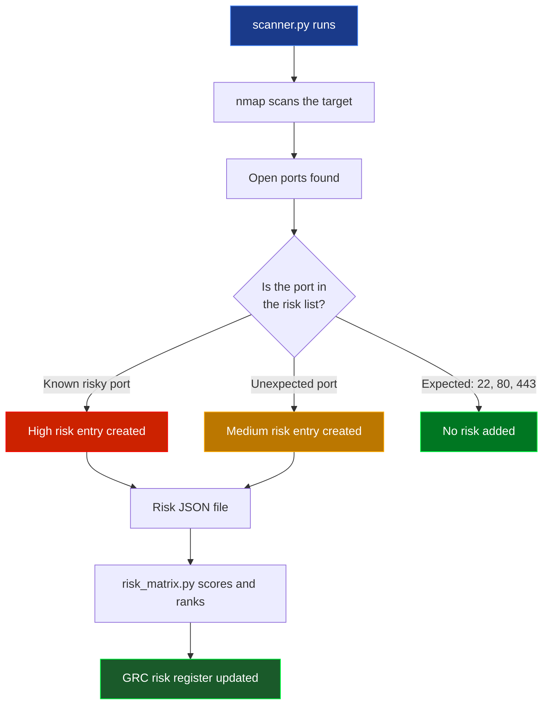
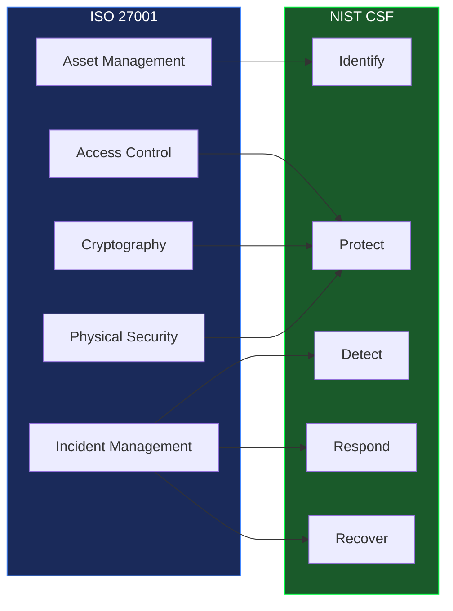
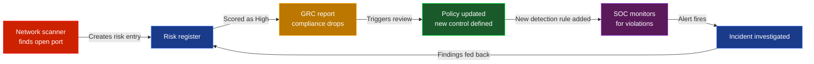
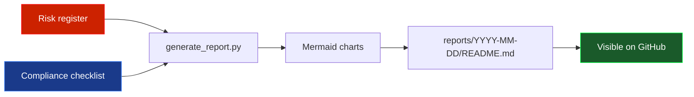

<div align="center">


<br/>


</div>

---

## What is this project?

This is a hands-on GRC project built from scratch in Python. It is designed for students and anyone learning how security governance actually works in practice — not just what the frameworks say on paper.

Every tool here solves a real problem that a GRC analyst deals with daily. You can run it, break it, modify it and learn from it.

---

## What is GRC?

**Governance, Risk and Compliance** is the framework organisations use to manage their security posture strategically. While a SOC focuses on detecting and responding to threats in real time, GRC focuses on making sure the right controls exist to prevent those threats in the first place.

Think of it this way:



A GRC analyst answers questions like:
- What are the biggest risks facing the organisation right now?
- Do our security controls actually match what the policy says?
- Are we compliant with ISO 27001, NIST or other frameworks?
- What happens if this risk materialises — how bad would it be?
- How do we prioritise what to fix first?

---

## The three pillars of GRC

### Governance — setting the rules

Governance is about defining who is responsible for security, what the rules are, and making sure those rules are followed. Without governance, security is just a collection of random tools with no strategy behind them.

This project includes a security policy template that covers access control, patch management, incident response, data handling and physical security.

### Risk — knowing what could go wrong

Risk management is about systematically identifying threats, assessing how likely they are and how bad the impact would be, then deciding what to do about them.



### Compliance — checking the controls

Compliance means verifying that your actual security controls match the requirements of a framework like ISO 27001 or NIST CSF. It is not enough to have a policy — you need to prove the controls are actually working.

---

## GRC categories — what GRC covers

| Category | What it involves | Tools in this project |
|---|---|---|
| Risk Assessment | Identify, score and rank risks | `risk_matrix.py` |
| Network Exposure | Find gaps between policy and reality | `scanner.py` |
| Policy Management | Define rules for the organisation | `security_policy.md` |
| Compliance Checking | Verify controls against frameworks | `checklist.md` |
| Reporting | Track posture over time | `generate_report.py` |

---

## Risk scoring

Risks are scored using the standard **likelihood x impact** matrix. Both values run from 1 to 5, giving a score between 1 and 25.



| Score | Level | What to do |
|---|---|---|
| 1 – 4 | Low | Accept or monitor |
| 5 – 9 | Medium | Treat within 90 days |
| 10 – 16 | High | Treat within 30 days |
| 17 – 25 | Critical | Treat immediately |

**Example output:**

```
Risk Assessment Report
======================================================================
ID         Risk                            Score   Level      Owner
----------------------------------------------------------------------
RISK-002   Phishing attack                 20      Critical   Security Team
RISK-001   Unpatched systems               20      Critical   IT Operations
RISK-005   SQL injection data breach       15      High       Dev Team
RISK-003   Insider threat                  10      High       HR / Security
RISK-004   DDoS attack                     9       Medium     Network Team
RISK-006   Lost or stolen laptop           6       Medium     IT Operations
```

---

## Network scanning

One of the most important things in GRC is checking whether your controls on paper actually match what is happening on your network. The scanner finds open ports and converts them directly into risk register entries.

> Only scan hosts you own or have written permission to test.



**Ports that automatically create a High risk entry:**

| Port | Service | Why it is dangerous |
|---|---|---|
| 21 | FTP | Sends credentials in plaintext |
| 23 | Telnet | Everything sent unencrypted |
| 25 | SMTP | Open relay allows spam and spoofing |
| 445 | SMB | Primary ransomware vector — WannaCry used this |
| 3389 | RDP | Constant brute force and exploitation target |
| 3306 | MySQL | Databases must never be publicly exposed |
| 5432 | PostgreSQL | Same as MySQL |
| 6379 | Redis | Often runs with no authentication by default |
| 27017 | MongoDB | Countless breaches from exposed instances |
| 8080 | HTTP Alt | Dev servers often running without TLS |

---

## Compliance frameworks

This project maps controls to two major frameworks. Understanding both is essential for any GRC role.

### ISO 27001

ISO 27001 is the international standard for information security management. It defines a set of controls across 14 domains that organisations must implement to achieve certification.

### NIST CSF

The NIST Cybersecurity Framework organises security activities into five core functions that describe the full lifecycle of security management.



**Coverage in this project:**

| ISO 27001 Domain | NIST CSF Function | Checklist section |
|---|---|---|
| Access Control | Protect | Access Management |
| Asset Management | Identify | Endpoint Security |
| Incident Management | Respond, Recover | Incident Response |
| Cryptography | Protect | Data Protection |
| Physical Security | Protect | Physical Security |
| Logging and Monitoring | Detect | Logging and Monitoring |

---

## How GRC and SOC connect

GRC does not operate in isolation. The SOC detects threats in real time. GRC makes sure the controls that should prevent those threats are actually in place.



The SOC and GRC feed each other. When the scanner finds something exposed, it feeds into the risk register. The policy is updated. The SOC gets a new detection rule. When an alert fires, the findings go back into the risk register. One continuous loop.

---

## Weekly reports

A report runs automatically every Monday, Wednesday and Friday. Each report shows compliance score per control area, open risks by severity and alert trends. Reports are stored in `reports/YYYY-MM-DD/`.



All reports are in the [`reports/`](./reports/README.md) folder.

---

## Tools

| Tool | File | What it does |
|---|---|---|
| Risk Matrix | `grc/risk-assessment/risk_matrix.py` | Scores and ranks risks using likelihood x impact |
| Network Scanner | `grc/network-scan/scanner.py` | Finds exposed ports and converts them to risk entries |
| Security Policy | `grc/policies/security_policy.md` | Policy template covering key control areas |
| Compliance Checklist | `grc/compliance/checklist.md` | ISO 27001 and NIST CSF control checklist |
| Report Generator | `scripts/generate_report.py` | Generates weekly compliance and risk reports |

---

## Project structure

```
grc-project/
├── grc/
│   ├── risk-assessment/
│   │   ├── risk_matrix.py       <- likelihood x impact scoring engine
│   │   └── sample_risks.json    <- example risk register with 6 risks
│   ├── network-scan/
│   │   └── scanner.py           <- nmap-based exposure scanner
│   ├── policies/
│   │   └── security_policy.md  <- security policy template
│   └── compliance/
│       └── checklist.md        <- ISO 27001 and NIST CSF checklist
├── scripts/
│   └── generate_report.py      <- weekly report generator
├── reports/
│   └── README.md               <- index of all generated reports
├── tests/
│   ├── test_risk_matrix.py     <- 8 risk matrix tests
│   └── test_scanner.py         <- 5 scanner tests
├── .github/workflows/
│   ├── tests.yml               <- runs on every push
│   └── weekly-report.yml       <- Mon, Wed, Fri at 08:00 UTC
├── requirements.txt
├── CONTRIBUTING.md
└── CHANGELOG.md
```

---

## Quickstart

```bash
git clone https://github.com/Speed-boo3/grc-project.git
cd grc-project
pip install -r requirements.txt
```

**Score your risks**
```bash
python grc/risk-assessment/risk_matrix.py --file grc/risk-assessment/sample_risks.json
```

**Scan for network exposure**
```bash
python grc/network-scan/scanner.py --target localhost --output network_risks.json
python grc/risk-assessment/risk_matrix.py --file network_risks.json
```

**Generate a report**
```bash
python scripts/generate_report.py
```

---

## Tests

13 tests covering the risk matrix and network scanner. Runs automatically on every push.

```bash
pytest tests/ -v
```

---

## Test your knowledge

Built this quiz for students learning GRC from scratch. 20 questions across all 8 categories — each with a full explanation so you learn as you go.

<div align="center">

[](https://speed-boo3.github.io/grc-project/quiz/)

</div>

Topics covered: What is GRC, Governance, Risk Management, Risk Scoring, ISO 27001, NIST CSF, Compliance, Network Exposure.

---

## Want to learn more about GRC?

- [ISO 27001 Overview](https://www.iso.org/isoiec-27001-information-security.html) — the international security management standard
- [NIST Cybersecurity Framework](https://www.nist.gov/cyberframework) — the five-function security lifecycle
- [NIST SP 800-30](https://csrc.nist.gov/publications/detail/sp/800-30/rev-1/final) — risk assessment guide
- [CIS Controls](https://www.cisecurity.org/controls) — prioritised security best practices

---

## Related

The SOC side of this work is in [soc-project](https://github.com/Speed-boo3/soc-project). GRC defines what controls should be in place. SOC monitors whether they are working.

<div align="center">

</div>
