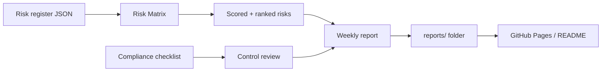
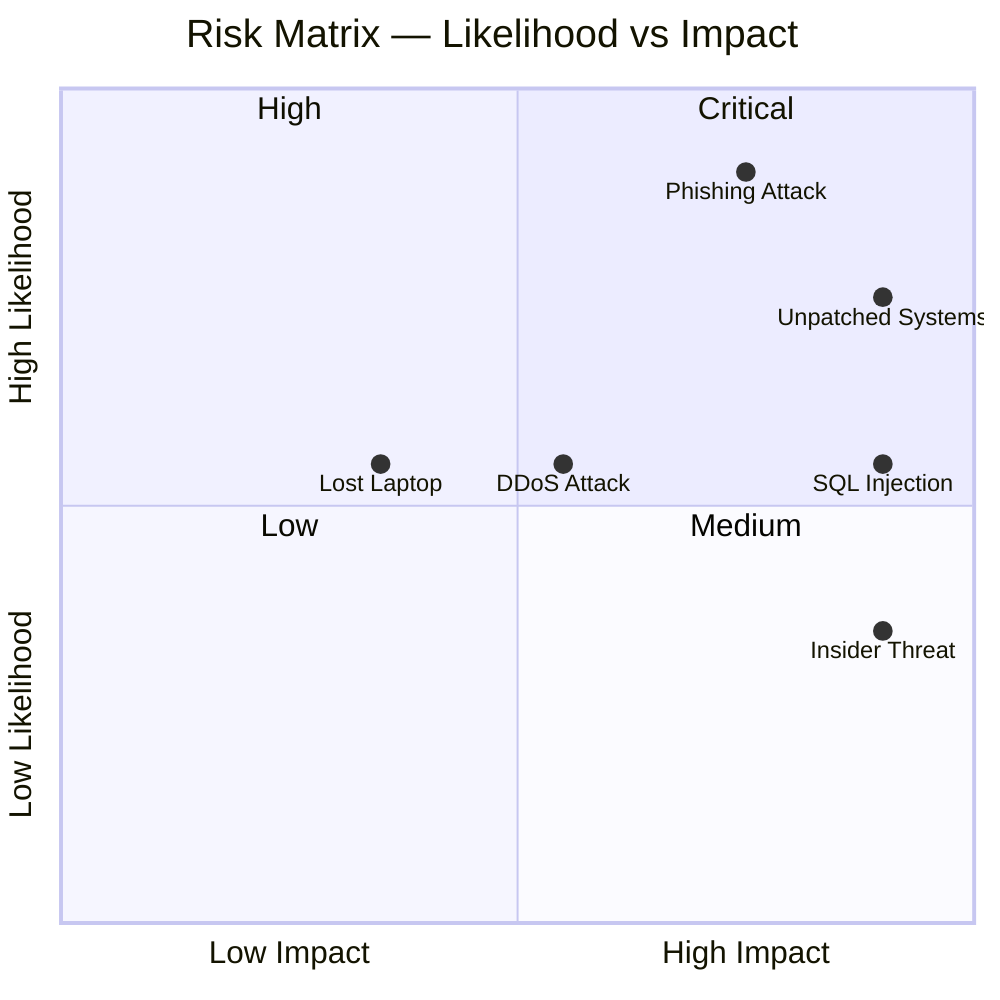
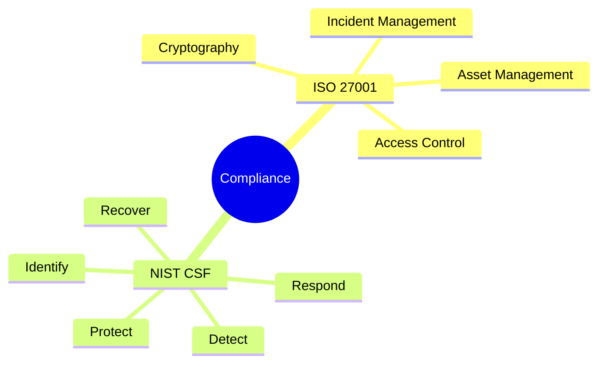
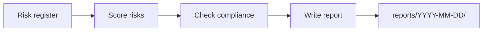
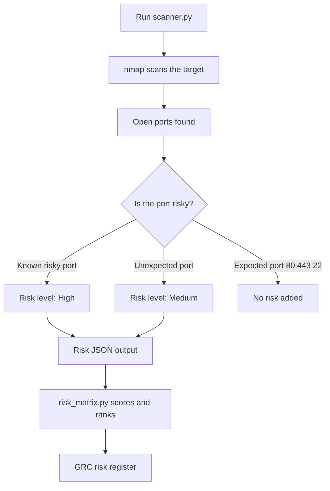
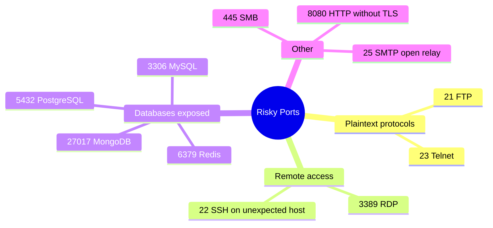
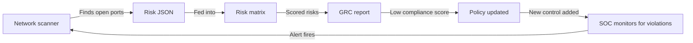

# GRC Project


A Governance, Risk and Compliance project built as part of a master's in cybersecurity. It covers risk assessment, security policy, compliance checking and weekly reporting.

---

## What this project does



---

## Project structure

```
grc-project/
├── grc/
│   ├── risk-assessment/
│   │   ├── risk_matrix.py       # Scores and ranks risks
│   │   └── sample_risks.json    # Example risk register
│   ├── policies/
│   │   └── security_policy.md  # Sample security policy
│   └── compliance/
│       └── checklist.md        # ISO 27001 / NIST CSF checklist
├── scripts/
│   └── generate_report.py      # Generates weekly reports
├── reports/
│   └── README.md               # Index of all generated reports
├── tests/
│   └── test_risk_matrix.py
├── .github/workflows/
│   └── weekly-report.yml       # Runs Mon, Wed, Fri at 08:00
├── requirements.txt
├── CONTRIBUTING.md
└── CHANGELOG.md
```

---

## How it works

### Risk assessment

```bash
python grc/risk-assessment/risk_matrix.py --file grc/risk-assessment/sample_risks.json
```

Risks are scored using a standard **likelihood × impact** matrix. Each risk gets a score from 1 to 25 and is rated Low, Medium, High or Critical.

### Risk matrix



### Sample risk output

```
Risk Assessment Report
======================================================================
ID        Risk                           Score   Level      Owner
----------------------------------------------------------------------
RISK-002  Phishing attack                20      Critical   Security Team
RISK-001  Unpatched systems              20      Critical   IT Operations
RISK-005  Data breach via SQL injection  15      High       Dev Team
RISK-003  Insider threat                 10      High       HR / Security
RISK-004  DDoS attack                    9       Medium     Network Team
RISK-006  Lost or stolen laptop          6       Medium     IT Operations
```

---

## Compliance coverage

The checklist maps to two frameworks:



---

## Reports

I put together a weekly report that tracks compliance scores and risk levels over time. It covers the same control areas as the checklist and gives a quick snapshot of where things stand.

The reports live in the [`reports/`](./reports/README.md) folder, one subfolder per date. Each report includes charts for compliance score by area, open risks by severity, and alert trends from the SOC side.



---

## Setup

```bash
git clone https://github.com/Speed-boo3/grc-project.git
cd grc-project
pip install -r requirements.txt
```

---

## Running the tests

```bash
pytest tests/
```

---

## Related project

The SOC side of this work is in a separate repo: [soc-project](https://github.com/Speed-boo3/soc-project)

GRC defines the controls and policies. The SOC monitors whether those controls are working. They feed each other.

---

## Network Scanning

One of the most important parts of GRC work is checking whether the controls you have on paper actually match reality. The network scanner does exactly that — it scans a host, finds open ports, and turns them into risks that feed directly into the risk register.

> **Important:** Only scan hosts you own or have explicit permission to scan. This tool is intended for use on `localhost` or a private lab network.

---

### How the scan pipeline works



---

### What counts as a risky port



---

### Running the scanner

```bash
python grc/network-scan/scanner.py --target localhost --output network_risks.json
```

Then feed the output straight into the risk matrix:

```bash
python grc/risk-assessment/risk_matrix.py --file network_risks.json
```

---

### Example output

When the scanner finds a risky port, it looks like this:

```
Network Scan Report
Target  : localhost
Date    : 2026-03-16 08:00
============================================================

Open ports found: 4
  22     ssh
  80     http
  443    https
  3306   mysql (8.0.32)

Risks identified: 1

  ID           Risk                                Level
  ------------------------------------------------------------
  NET-3306     MySQL exposed on port 3306          High

Details:

  NET-3306 -- MySQL exposed on port 3306
    Port     : 3306 (mysql)
    Reason   : Database should not be exposed outside the local network.
    Score    : 16 -> High
    Treatment: Close the port if not needed, or restrict with firewall rules.
```

---

### How it connects to the rest of the project



This closes the loop between SOC and GRC. The scanner finds a weakness, GRC registers it as a risk, the policy is updated to address it, and the SOC monitors for violations going forward.
