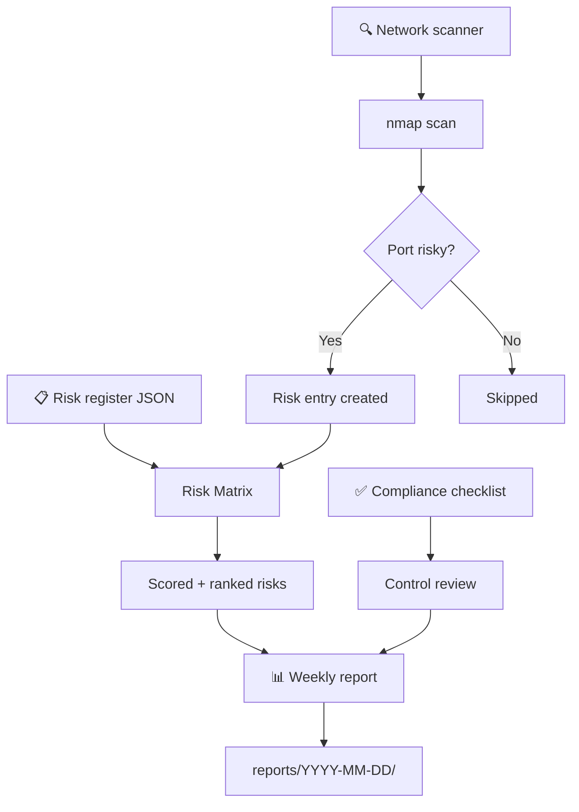
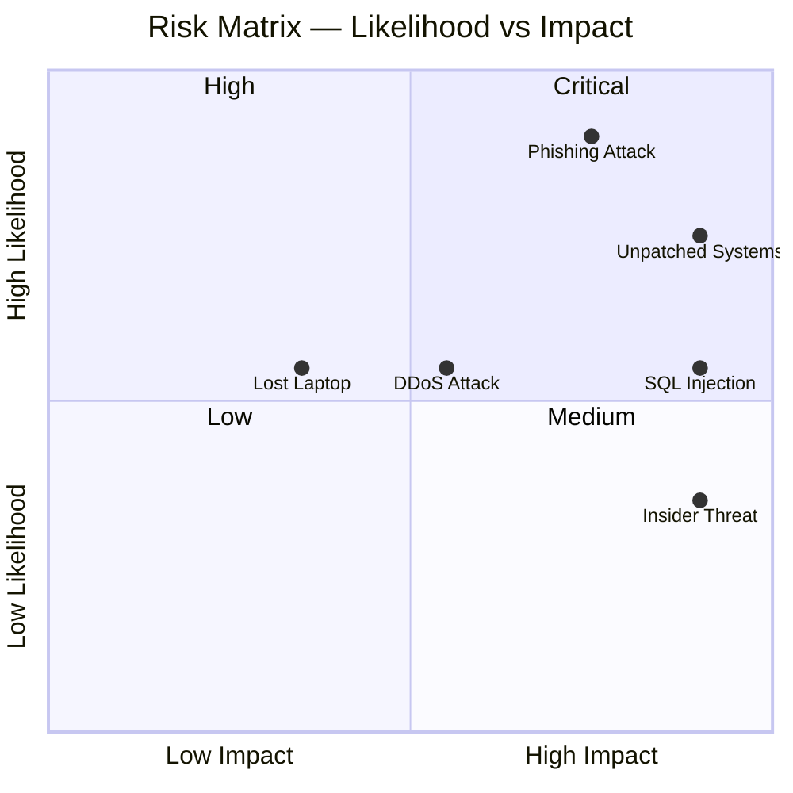
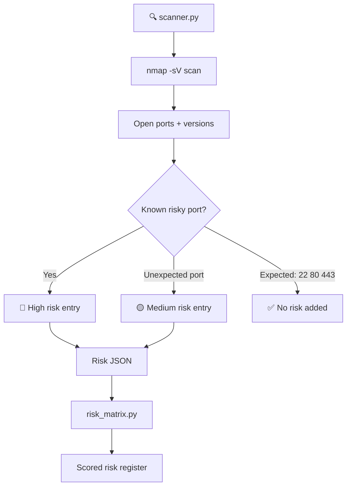
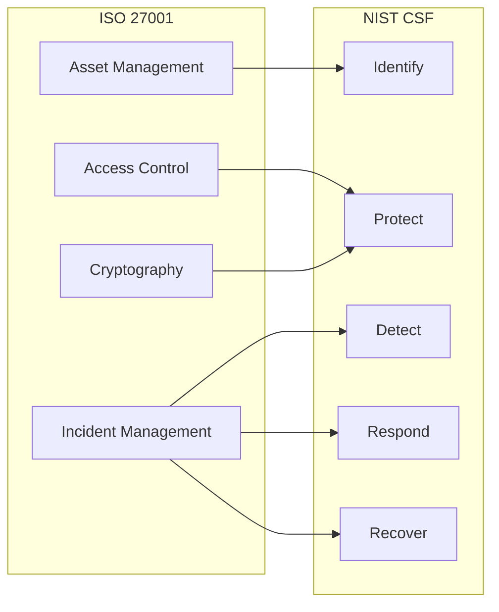
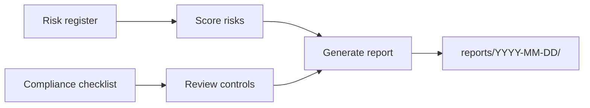
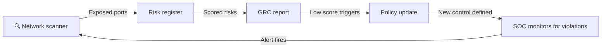

# GRC Project


A Governance, Risk and Compliance toolkit built in Python. It scores risks, scans the network for exposure, checks compliance against ISO 27001 and NIST CSF, and generates weekly reports.

---

## How it works



---

## Components

| Component | File | What it does |
|---|---|---|
| Risk Matrix | `grc/risk-assessment/risk_matrix.py` | Scores risks using likelihood × impact |
| Network Scanner | `grc/network-scan/scanner.py` | Finds exposed ports and converts them to risks |
| Security Policy | `grc/policies/security_policy.md` | Policy template covering key control areas |
| Compliance Checklist | `grc/compliance/checklist.md` | ISO 27001 / NIST CSF control checklist |
| Report Generator | `scripts/generate_report.py` | Generates weekly compliance and risk reports |

---

## Risk scoring

Risks are scored using **likelihood × impact**. Both values run from 1 to 5, giving a score between 1 and 25.



| Score | Level |
|---|---|
| 1 – 4 | 🟢 Low |
| 5 – 9 | 🟡 Medium |
| 10 – 16 | 🟠 High |
| 17 – 25 | 🔴 Critical |

**Example output:**

```
Risk Assessment Report
======================================================================
ID         Risk                            Score   Level      Owner
----------------------------------------------------------------------
RISK-002   Phishing attack                 20      Critical   Security Team
RISK-001   Unpatched systems               20      Critical   IT Operations
RISK-005   SQL injection data breach       15      High       Dev Team
RISK-003   Insider threat                  10      High       HR / Security
RISK-004   DDoS attack                     9       Medium     Network Team
RISK-006   Lost or stolen laptop           6       Medium     IT Operations
```

---

## Network scanning

The scanner runs nmap against a target, identifies risky open ports and converts them directly into risk register entries. This closes the gap between what your policy says should be closed and what is actually exposed.

> ⚠️ Only scan hosts you own or have explicit written permission to test.



**Ports that trigger a High risk:**

| Port | Service | Why |
|---|---|---|
| 21 | FTP | Sends credentials in plaintext |
| 23 | Telnet | Everything sent unencrypted |
| 25 | SMTP | Open relay risk |
| 445 | SMB | Primary ransomware vector |
| 3389 | RDP | Constant brute force target |
| 3306 | MySQL | Databases must not be publicly exposed |
| 5432 | PostgreSQL | Same as MySQL |
| 6379 | Redis | Often runs with no authentication |
| 27017 | MongoDB | Misconfigured instances cause frequent breaches |
| 8080 | HTTP Alt | Dev servers often running without TLS |

**Example scanner output:**

```
Network Scan Report
Target  : localhost
Date    : 2026-03-16 08:00
============================================================

Open ports found: 4
  22     ssh
  80     http
  443    https
  3306   mysql (8.0.32)

Risks identified: 1

  NET-3306 — MySQL exposed on port 3306
    Port     : 3306 (mysql)
    Reason   : Database should not be exposed outside the local network.
    Score    : 16 -> High
    Treatment: Close the port or restrict access with firewall rules.
```

---

## Compliance coverage

The checklist maps controls to both ISO 27001 and NIST CSF so you can track coverage across both frameworks at once.

| ISO 27001 | NIST CSF |
|---|---|
| Access Control | Identify |
| Asset Management | Protect |
| Incident Management | Detect |
| Cryptography | Respond |
| Physical Security | Recover |



---

## Weekly reports

A report is generated every Monday, Wednesday and Friday. Each report shows compliance score per control area, open risks by severity and alert trends from the SOC side. Reports are stored in `reports/YYYY-MM-DD/README.md`.



All reports are in the [`reports/`](./reports/README.md) folder.

---

## How GRC and SOC connect



GRC defines what controls should be in place. The SOC monitors whether they are actually working. When the scanner finds something exposed that shouldn't be, it feeds into the risk register, the policy is updated, and the SOC gets a new rule to watch for. One loop, two tools.

---

## Project structure

```
grc-project/
├── grc/
│   ├── risk-assessment/
│   │   ├── risk_matrix.py       ← likelihood × impact scoring engine
│   │   └── sample_risks.json    ← example risk register
│   ├── network-scan/
│   │   └── scanner.py           ← nmap-based exposure scanner
│   ├── policies/
│   │   └── security_policy.md  ← security policy template
│   └── compliance/
│       └── checklist.md        ← ISO 27001 / NIST CSF checklist
├── scripts/
│   └── generate_report.py      ← weekly report generator
├── reports/
│   └── README.md               ← index of all reports
├── tests/
│   ├── test_risk_matrix.py     ← 8 risk matrix tests
│   └── test_scanner.py         ← 5 scanner tests
├── .github/workflows/
│   ├── tests.yml               ← runs on every push
│   └── weekly-report.yml       ← Mon, Wed, Fri at 08:00 UTC
├── requirements.txt
├── CONTRIBUTING.md
└── CHANGELOG.md
```

---

## Quickstart

```bash
git clone https://github.com/Speed-boo3/grc-project.git
cd grc-project
pip install -r requirements.txt
```

**Score your risks**
```bash
python grc/risk-assessment/risk_matrix.py --file grc/risk-assessment/sample_risks.json
```

**Scan for network exposure**
```bash
python grc/network-scan/scanner.py --target localhost --output network_risks.json
python grc/risk-assessment/risk_matrix.py --file network_risks.json
```

**Generate a report**
```bash
python scripts/generate_report.py
```

---

## Tests

13 tests covering the risk matrix and network scanner. Runs automatically on every push via GitHub Actions.

```bash
pytest tests/ -v
```

---

## Related

The SOC side of this work is in [soc-project](https://github.com/Speed-boo3/soc-project) — log parsing, alert detection and MITRE ATT&CK-mapped rules. GRC defines what should be in place. SOC checks whether it is.
