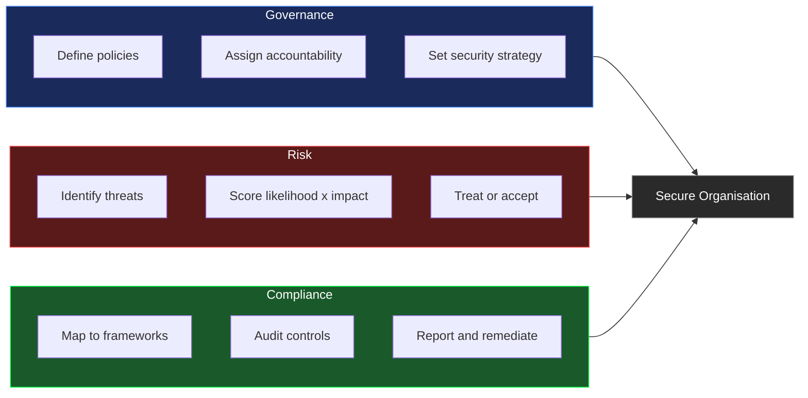
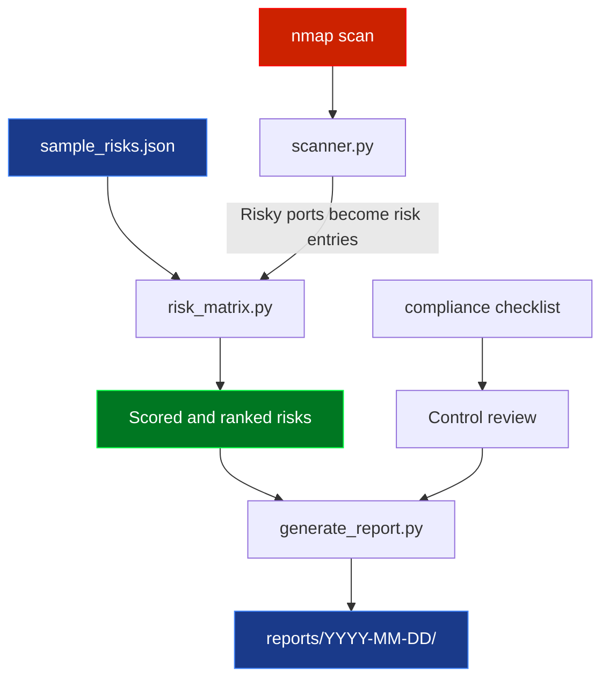
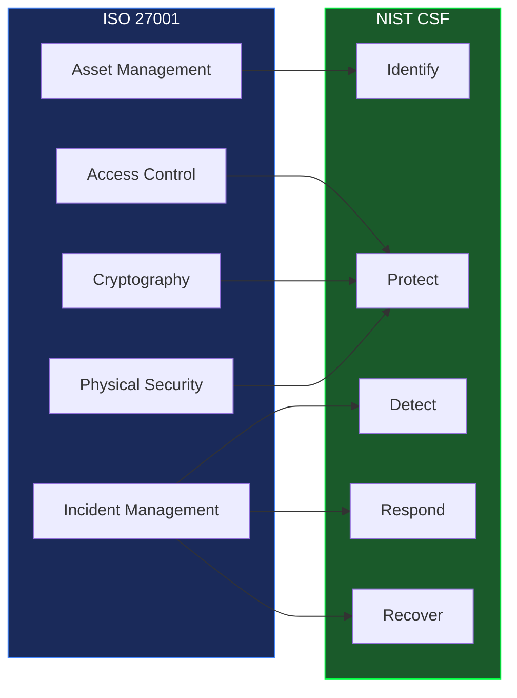
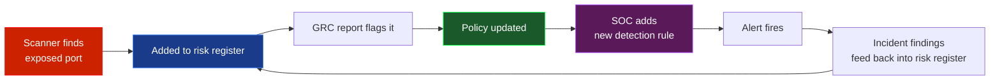

<div align="center">


<br/>


</div>

---

## What is this

A hands-on GRC project built from scratch in Python. Designed for students who want to understand what governance, risk and compliance actually involves in practice — not just what the textbooks say.

Every tool here solves a problem that real GRC analysts deal with daily. Risk scoring, network exposure checking, compliance tracking and automated reporting. You can run it, break it and learn from it.

---

## What is GRC

GRC stands for **Governance, Risk and Compliance**. It is how organisations manage their security posture strategically. While a SOC analyst responds to threats in real time, a GRC analyst asks harder questions:

- Do we know what our biggest risks actually are?
- Does our network match what our security policy says it should?
- Are we compliant with GDPR, ISO 27001, NIST or other frameworks?
- If a risk materialises, how bad will it be?
- How do we decide what to fix first?

These are strategic questions that sit above the day-to-day technical work. GRC is where security meets business.

---

## The three pillars



**Governance** is about setting the rules — policies, procedures and making sure people follow them. Without governance, security is a collection of tools with no strategy behind it.

**Risk** is about systematically identifying what could go wrong, scoring each threat by likelihood and impact, and deciding what to do about it. Not everything can be fixed at once, so risk scoring tells you what to fix first.

**Compliance** is about proving your controls actually exist and work. Not just having a policy that says "we encrypt data" — but being able to show, in an audit, that you actually do.

---

## How the tools connect



---

## Tools

### Risk Matrix `grc/risk-assessment/risk_matrix.py`

Scores risks using likelihood × impact. Both run from 1 to 5, giving a score between 1 and 25. Risks are sorted from most critical to least so you always know what needs attention first.

```bash
python grc/risk-assessment/risk_matrix.py --file grc/risk-assessment/sample_risks.json
```

Output:

```
Risk Assessment Report
======================================================================
ID         Risk                            Score   Level      Owner
----------------------------------------------------------------------
RISK-002   Phishing attack                  20     Critical   Security Team
RISK-001   Unpatched systems                20     Critical   IT Operations
RISK-005   SQL injection data breach        15     High       Dev Team
RISK-003   Insider threat                   10     High       HR / Security
RISK-004   DDoS attack                       9     Medium     Network Team
RISK-006   Lost or stolen laptop             6     Medium     IT Operations
```

The scoring scale:

```
Score  1–4    Low       Accept or monitor
Score  5–9    Medium    Treat within 90 days
Score  10–16  High      Treat within 30 days
Score  17–25  Critical  Treat immediately
```

### Network Scanner `grc/network-scan/scanner.py`

Runs nmap against a target and checks every open port against a list of known dangerous services. Risky ports are automatically converted into structured risk register entries that feed directly into the risk matrix.

This is one of the most important things a GRC analyst does — checking whether the network actually matches what the security policy says it should.

```bash
python grc/network-scan/scanner.py --target localhost --output network_risks.json
python grc/risk-assessment/risk_matrix.py --file network_risks.json
```

> Only scan hosts you own or have written permission to test.

Output when a risky port is found:

```
Network Scan Report
Target  : localhost
============================================================
Open ports: 22, 80, 443, 3306 (mysql 8.0.32)

Risks identified: 1

  NET-3306 — MySQL exposed on port 3306
    Reason   : Databases should not be publicly accessible
    Score    : 16 → High
    Treatment: Restrict with firewall rules or close the port
```

Ports that automatically generate a High risk entry:

```
21    FTP         credentials sent in plaintext
23    Telnet      everything unencrypted
25    SMTP        open relay risk
445   SMB         primary ransomware vector
3389  RDP         constant brute force target
3306  MySQL       databases must not be public
5432  PostgreSQL  same as MySQL
6379  Redis       often runs with no authentication
27017 MongoDB     many breaches from exposed instances
8080  HTTP Alt    dev servers without TLS
```

### Security Policy `grc/policies/security_policy.md`

A policy template covering the areas every real security policy needs: access control, patch management, incident response, data handling and physical security.

Policies are the foundation of governance. Without a written policy, you have no baseline to measure against in an audit.

### Compliance Checklist `grc/compliance/checklist.md`

A practical checklist built from ISO 27001 and NIST CSF controls. Work through it and score what percentage of controls are in place.

The two frameworks this project covers:

**ISO 27001** is the international standard for information security management. Organisations can get certified to prove their controls are real and working. It covers 93 controls across four themes.

**NIST CSF** organises security into five functions: Identify, Protect, Detect, Respond and Recover. Widely used in the US and increasingly everywhere else.



### Report Generator `scripts/generate_report.py`

Generates a markdown report with charts every Monday, Wednesday and Friday. Each report shows compliance score per control area, open risks by severity and alert trends. Stored in `reports/YYYY-MM-DD/`.

```bash
python scripts/generate_report.py
```

All previous reports are in [`reports/`](./reports/README.md).

---

## How GRC and SOC connect

GRC and SOC are not separate functions — they feed each other continuously.



When the scanner finds a database exposed to the internet, it goes into the risk register. The compliance score drops. That triggers a policy review. The SOC gets a new detection rule. When the rule fires, the incident findings feed back into the risk register and the loop continues.

One loop. Two teams. Stronger together.

---

## Project structure

```
grc-project/
├── grc/
│   ├── risk-assessment/
│   │   ├── risk_matrix.py       ← likelihood × impact scoring engine
│   │   └── sample_risks.json    ← example risk register with 6 risks
│   ├── network-scan/
│   │   └── scanner.py           ← nmap wrapper with GRC risk output
│   ├── policies/
│   │   └── security_policy.md  ← security policy template
│   └── compliance/
│       └── checklist.md        ← ISO 27001 and NIST CSF checklist
├── scripts/
│   └── generate_report.py      ← weekly report generator
├── reports/
│   └── README.md               ← index of all reports
├── tests/
│   ├── test_risk_matrix.py     ← 8 tests
│   └── test_scanner.py         ← 5 tests
├── .github/workflows/
│   ├── tests.yml               ← runs on every push
│   └── weekly-report.yml       ← Mon, Wed, Fri at 08:00 UTC
├── requirements.txt
├── CONTRIBUTING.md
└── CHANGELOG.md
```

---

## Quickstart

```bash
git clone https://github.com/Speed-boo3/grc-project.git
cd grc-project
pip install -r requirements.txt
```

Score risks:

```bash
python grc/risk-assessment/risk_matrix.py --file grc/risk-assessment/sample_risks.json
```

Scan for exposure:

```bash
python grc/network-scan/scanner.py --target localhost --output network_risks.json
python grc/risk-assessment/risk_matrix.py --file network_risks.json
```

Generate report:

```bash
python scripts/generate_report.py
```

Run tests:

```bash
pytest tests/ -v
```

---

## Test your knowledge

20 questions covering GRC fundamentals — governance, risk scoring, ISO 27001, NIST CSF, compliance and network exposure. Each question includes a full explanation.

<div align="center">

[](https://speed-boo3.github.io/grc-project/quiz/)

</div>

---

## Learn more

- [ISO 27001](https://www.iso.org/isoiec-27001-information-security.html) — international security management standard
- [NIST CSF](https://www.nist.gov/cyberframework) — five-function security lifecycle
- [NIST SP 800-30](https://csrc.nist.gov/publications/detail/sp/800-30/rev-1/final) — risk assessment guide
- [NIST SP 800-53](https://csrc.nist.gov/publications/detail/sp/800-53/rev-5/final) — security and privacy controls
- [CIS Controls](https://www.cisecurity.org/controls) — prioritised security best practices
- [GDPR overview](https://gdpr.eu/what-is-gdpr/) — EU data protection regulation

---

The SOC side of this project is in [soc-project](https://github.com/Speed-boo3/soc-project). SOC detects what is happening. GRC tracks whether the controls that should prevent it are actually in place.

<div align="center">

</div>
