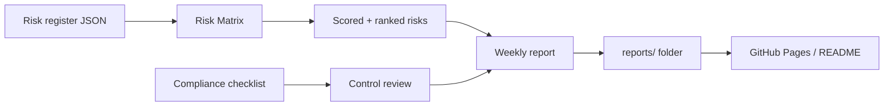
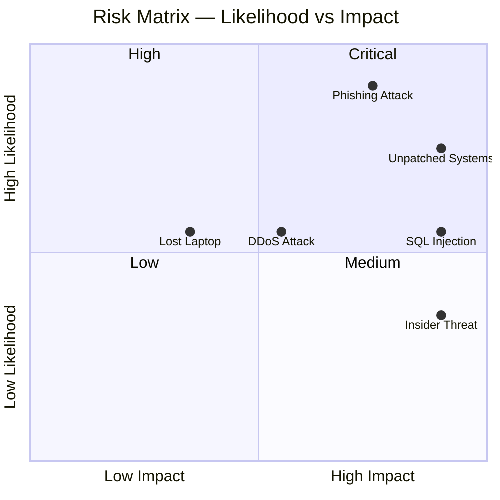
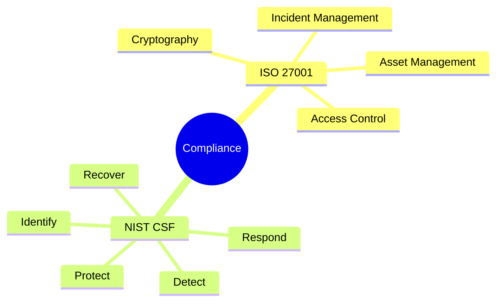

# GRC Project


A Governance, Risk and Compliance project built as part of a master's in cybersecurity. It covers risk assessment, security policy, compliance checking and automated reporting.

---

## What this project does



---

## Project structure

```
grc-project/
├── grc/
│   ├── risk-assessment/
│   │   ├── risk_matrix.py       # Scores and ranks risks
│   │   └── sample_risks.json    # Example risk register
│   ├── policies/
│   │   └── security_policy.md  # Sample security policy
│   └── compliance/
│       └── checklist.md        # ISO 27001 / NIST CSF checklist
├── scripts/
│   └── generate_report.py      # Auto-generates weekly reports
├── reports/
│   └── README.md               # Index of all generated reports
├── tests/
│   └── test_risk_matrix.py
├── .github/workflows/
│   └── weekly-report.yml       # Runs Mon, Wed, Fri at 08:00
├── requirements.txt
├── CONTRIBUTING.md
└── CHANGELOG.md
```

---

## How it works

### Risk assessment

```bash
python grc/risk-assessment/risk_matrix.py --file grc/risk-assessment/sample_risks.json
```

Risks are scored using a standard **likelihood × impact** matrix. Each risk gets a score from 1 to 25 and is rated Low, Medium, High or Critical.

### Risk matrix



### Sample risk output

```
Risk Assessment Report
======================================================================
ID        Risk                           Score   Level      Owner
----------------------------------------------------------------------
RISK-002  Phishing attack                20      Critical   Security Team
RISK-001  Unpatched systems              20      Critical   IT Operations
RISK-005  Data breach via SQL injection  15      High       Dev Team
RISK-003  Insider threat                 10      High       HR / Security
RISK-004  DDoS attack                    9       Medium     Network Team
RISK-006  Lost or stolen laptop          6       Medium     IT Operations
```

---

## Compliance coverage

The checklist maps to two frameworks:



---

## Automated reports

Every Monday, Wednesday and Friday at 08:00 UTC, GitHub Actions runs `scripts/generate_report.py`. It generates a new report with Mermaid charts showing:

- Compliance score per control area
- Risk distribution by severity
- 7-day alert trend (from simulated SOC data)

Reports are saved to `reports/YYYY-MM-DD/README.md` and the index at `reports/README.md` is updated automatically.

```mermaid
gantt
    title Automated Report Schedule
    dateFormat  HH:mm
    axisFormat %A
    section Weekly
    Monday report    :done, mon, 08:00, 1h
    Wednesday report :done, wed, 08:00, 1h
    Friday report    :done, fri, 08:00, 1h
```



All generated reports are in the [`reports/`](./reports/README.md) folder.

---

## Setup

```bash
git clone https://github.com/Speed-boo3/grc-project.git
cd grc-project
pip install -r requirements.txt
```

---

## Running the tests

```bash
pytest tests/
```

---

## Related project

The SOC side of this work is in a separate repo: [soc-project](https://github.com/Speed-boo3/soc-project)

GRC defines the controls and policies. The SOC monitors whether those controls are working. They feed each other.
