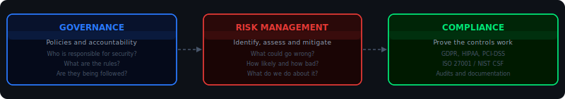
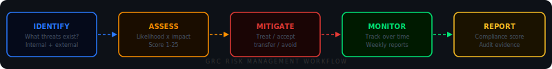
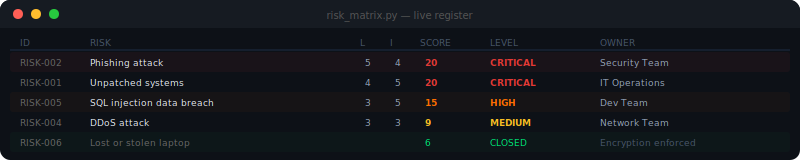
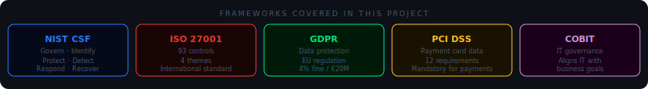

<div align="center">


<br/>


<br/>

[](https://speed-boo3.github.io/grc-project/explain/)

</div>

---

## What is GRC?

GRC stands for Governance, Risk Management, and Compliance. It is how organisations approach cybersecurity strategically — not just technically.



**Governance** means setting the rules and deciding who is responsible. Who owns the security policy? Who approves exceptions? Without governance, security is reactive and inconsistent.

**Risk Management** means identifying what could go wrong, scoring it by likelihood and impact, and deciding what to fix first. Not every risk is equal. Scoring them objectively tells you where to focus.

**Compliance** means proving that the controls you say you have are actually working. GDPR, ISO 27001, NIST CSF, PCI-DSS — these are the external standards organisations are held to. This project maps every control to the relevant framework.

GRC takes the technical security work that the SOC does and gives it strategic direction. The SOC detects threats. GRC makes sure the right controls exist to prevent them and that there is evidence it is happening.

---

<div align="center">

</div>

---

## How risk management works in practice



Every risk goes through this pipeline. It starts with identifying the threat, scoring it, deciding how to treat it, monitoring it over time and reporting the compliance status. The score tells you what to fix first when you cannot fix everything at once.

```bash
python grc/risk-assessment/risk_matrix.py --file grc/risk-assessment/sample_risks.json
```

```
Risk Assessment Report
======================================================================
ID         Risk                            Score   Level      Owner
----------------------------------------------------------------------
RISK-002   Phishing attack                  20     Critical   Security Team
RISK-001   Unpatched systems                20     Critical   IT Operations
RISK-005   SQL injection data breach        15     High       Dev Team
RISK-003   Insider threat                   10     High       HR / Security
RISK-004   DDoS attack                       9     Medium     Network Team
RISK-006   Lost or stolen laptop             6     Medium     IT Operations
```

The score is likelihood multiplied by impact, both on a 1 to 5 scale. A score of 20 means immediate action. A score of 6 might be acceptable if a mitigating control is already in place.

---

## The live risk register



The risk register is not static. Risks are added, updated and closed as the security posture changes. The CLI tool makes this easy without editing JSON manually.

```bash
# Add a new risk
python grc/risk-assessment/risk_manager.py add \
  --title "Ransomware attack" \
  --likelihood 4 --impact 5 \
  --owner "Security Team"

# Update a risk after a control is implemented
python grc/risk-assessment/risk_manager.py update RISK-001 --likelihood 2

# Close a risk with a note
python grc/risk-assessment/risk_manager.py close RISK-006 \
  --note "Full-disk encryption enforced on all devices"

# List all open risks
python grc/risk-assessment/risk_manager.py list --status open
```

---

## Frameworks covered



This project maps controls to five major frameworks. Most organisations use a combination rather than one in isolation.

**NIST CSF** is the most widely adopted in practice. Six functions: Govern, Identify, Protect, Detect, Respond, Recover. Flexible and adaptable to any organisation size.

**ISO 27001** is the international standard for information security management. 93 controls across four themes. Certification requires a two-stage external audit. This project includes a checklist for gap analysis.

**GDPR** applies to any organisation handling personal data of EU citizens. Maximum fine is 4% of global revenue or €20M, whichever is higher. Compliance requires documented controls and breach notification procedures.

**PCI DSS** is mandatory for organisations handling payment card data. 12 requirements covering network security, access control, encryption and monitoring.

**COBIT** aligns IT governance with business objectives. Particularly relevant for larger organisations with formal IT governance structures.

---

<div align="center">

</div>

---

## Network scanning as a GRC activity

Policy says what should be closed. The scanner checks what actually is.

```bash
python grc/network-scan/scanner.py --target 192.168.1.0/24
```

```
Network Security Assessment
======================================================================
Host: 192.168.1.1   Port 22 (SSH)    OPEN    Medium — restrict to VPN
Host: 192.168.1.10  Port 3306 (MySQL) OPEN   High   — should not be public
Host: 192.168.1.15  Port 443 (HTTPS) OPEN    Clean  — expected

Risk entries created: 2
Added to risk register: NET-001, NET-002
```

The gap between what the policy says and what the scan finds is where audit findings come from. This tool finds that gap and converts it directly into risk register entries.

---

## Automated compliance reports

GitHub Actions runs this every Monday, Wednesday and Friday at 08:00 UTC. The report goes into `reports/` automatically.

```bash
python scripts/generate_report.py
```

```
GRC Compliance Report — 2026-03-29
======================================================================
ISO 27001 Coverage    : 84%  (42 of 50 controls checked)
NIST CSF Coverage     : 78%  (39 of 50 controls checked)

Risk Distribution     : 2 Critical  3 High  2 Medium  1 Closed
Open Risks            : 7
Critical Risks        : 2 — require immediate action

Frameworks assessed   : ISO 27001, NIST CSF, GDPR, PCI-DSS
Report saved to       : reports/grc-report-2026-03-29.md
```

---

## Project structure

```
grc-project/
├── grc/
│   ├── risk-assessment/
│   │   ├── risk_matrix.py          <- scores risks by likelihood x impact
│   │   ├── risk_manager.py         <- CLI to add, update and close risks
│   │   └── sample_risks.json       <- 8 example risks with open/closed status
│   ├── network-scan/
│   │   └── scanner.py              <- nmap wrapper, converts findings to risks
│   ├── policies/
│   │   └── security_policy.md      <- full policy template
│   └── compliance/
│       └── checklist.md            <- ISO 27001 and NIST CSF controls
├── frameworks/
│   ├── iso27001.md                 <- ISO 27001 control summary
│   ├── nist-csf.md                 <- NIST CSF function mapping
│   └── gdpr.md                     <- GDPR requirements overview
├── scripts/
│   └── generate_report.py          <- weekly report generator
├── reports/                        <- auto-generated compliance reports
├── explain/
│   └── index.html                  <- interactive learning site
├── .github/workflows/
│   ├── weekly-report.yml           <- Mon, Wed, Fri 08:00 UTC
│   └── weekly-maintenance.yml      <- Mon 09:00 UTC
└── CHANGELOG.md
```

---

## Quickstart

```bash
git clone https://github.com/Speed-boo3/grc-project.git
cd grc-project
pip install -r requirements.txt
```

Score the risks:
```bash
python grc/risk-assessment/risk_matrix.py --file grc/risk-assessment/sample_risks.json
```

Manage the register:
```bash
python grc/risk-assessment/risk_manager.py list
python grc/risk-assessment/risk_manager.py add --title "New risk" --likelihood 3 --impact 4 --owner "Security Team"
```

Generate a report:
```bash
python scripts/generate_report.py
```

---

## Learn more

- [NIST CSF](https://www.nist.gov/cyberframework) — cybersecurity framework
- [ISO 27001](https://www.iso.org/isoiec-27001-information-security.html) — international ISMS standard
- [GDPR full text](https://gdpr-info.eu) — EU data protection regulation
- [PCI DSS](https://www.pcisecuritystandards.org) — payment card security standard
- [ISACA COBIT](https://www.isaca.org/resources/cobit) — IT governance framework
- [CISA resources](https://www.cisa.gov/resources-tools/resources) — US government security guidance

<div align="center">

</div>
