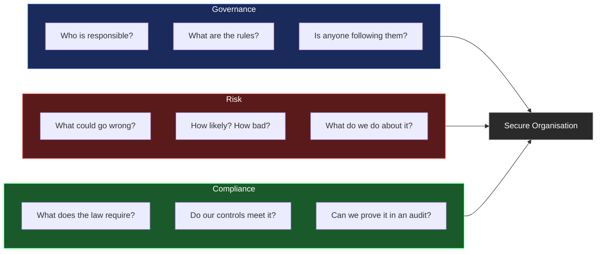
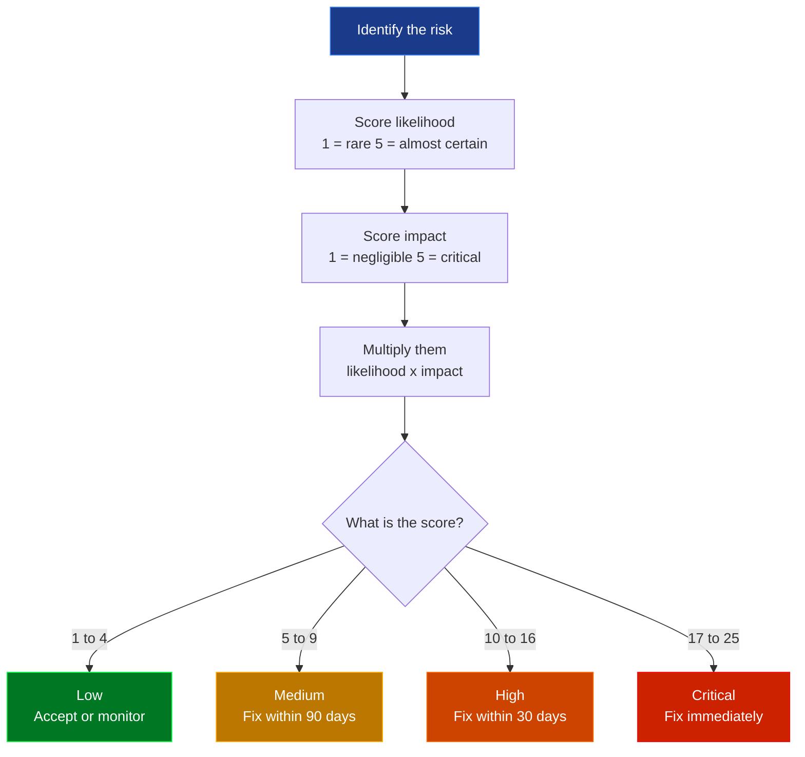
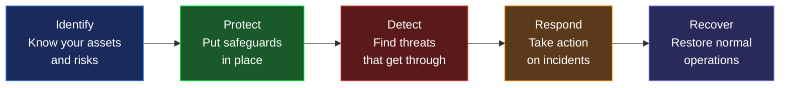
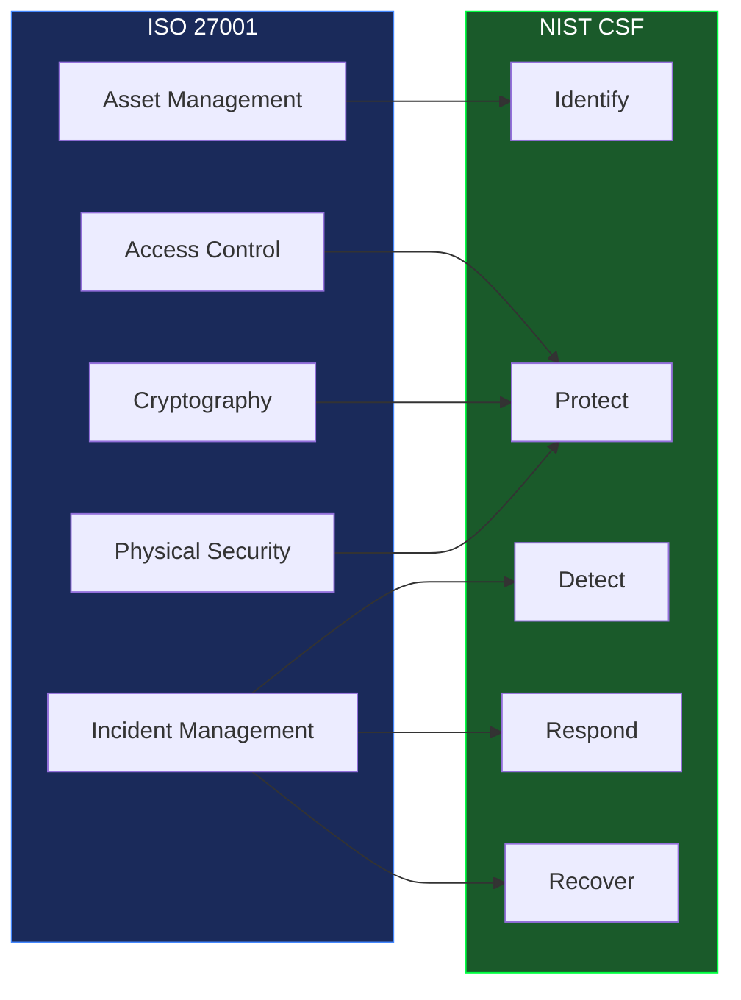
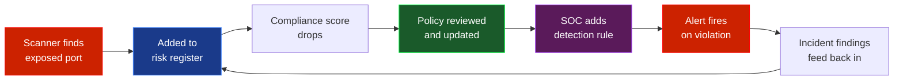

<div align="center">


<br/>


</div>

---

## Who this is for

This project is for students learning cybersecurity who want to understand what GRC work actually looks like — not just read about it. Every concept here is explained from scratch, and every tool has real output you can run yourself.

If you are studying for a career in security, GRC is one of the most in-demand areas right now. Almost every organisation has a GRC function, and many students overlook it in favour of purely technical work. This project will help you understand both sides.

---

## Start here — what is GRC?

**GRC** stands for **Governance, Risk and Compliance**.

Most people in cybersecurity focus on the technical side — firewalls, alerts, malware analysis. GRC is the strategic layer that sits above all of that. It answers the question: *does our organisation actually have the right controls in place, and can we prove it?*

Think of it like this. A SOC analyst responds when something goes wrong. A GRC analyst works to make sure it is less likely to go wrong in the first place — by identifying risks before they materialise, writing policies that define what "secure" looks like, and checking that those policies are actually being followed.

Neither is more important than the other. They are two sides of the same coin.

---

## The three pillars — explained simply



### Governance — setting the rules

Governance is about defining who is responsible for security, what the rules are, and making sure those rules are followed. This includes writing security policies, assigning ownership of controls and making sure leadership is involved in security decisions.

Without governance, security is a collection of tools with no strategy. You might have a great firewall, but if nobody is responsible for reviewing the rules, it will drift out of date.

*This project includes a security policy template in `grc/policies/security_policy.md`.*

### Risk — knowing what could go wrong

Risk management is about identifying threats to the organisation, working out how likely they are and how bad the consequences would be, and then deciding what to do. Not everything can be fixed at once, so you need a way to prioritise.

The standard approach is to score each risk by **likelihood** and **impact**, then multiply them. The result tells you what to fix first.

*This project includes a risk matrix tool in `grc/risk-assessment/risk_matrix.py`.*

### Compliance — proving your controls work

Compliance means meeting the requirements of a framework or regulation. ISO 27001, NIST CSF, GDPR — these are all sets of rules that organisations must follow. Compliance is not just about having a policy that says the right thing. It is about being able to show, in an audit, that you actually do what the policy says.

*This project includes a compliance checklist in `grc/compliance/checklist.md`.*

---

## Risk scoring — how it works

Every risk in the register gets two scores: how likely is it to happen, and how bad would it be if it did?

Both run from **1 to 5**. Multiply them together and you get a score between 1 and 25.



Running the risk matrix against the sample register:

```bash
python grc/risk-assessment/risk_matrix.py --file grc/risk-assessment/sample_risks.json
```

```
Risk Assessment Report
======================================================================
ID         Risk                            Score   Level      Owner
----------------------------------------------------------------------
RISK-002   Phishing attack                  20     Critical   Security Team
RISK-001   Unpatched systems                20     Critical   IT Operations
RISK-005   SQL injection data breach        15     High       Dev Team
RISK-003   Insider threat                   10     High       HR / Security
RISK-004   DDoS attack                       9     Medium     Network Team
RISK-006   Lost or stolen laptop             6     Medium     IT Operations
```

A phishing attack scores 20 because it is very likely (5) and would have major impact (4). A lost laptop scores only 6 because the likelihood is moderate and the impact is minor if the laptop is encrypted.

---

## Network scanning — closing the gap between policy and reality

One of the most important things in GRC is checking whether your network actually matches what your security policy says it should. You might have a policy that says "databases must not be publicly accessible" — but does the network actually enforce that?

The network scanner finds open ports and converts risky ones directly into risk register entries.

```bash
python grc/network-scan/scanner.py --target localhost --output network_risks.json
```

> Only ever scan systems you own or have written permission to test.

```
Network Scan Report
Target  : localhost
============================================================
Open ports: 22, 80, 443, 3306 (mysql 8.0.32)

Risks identified: 1

  NET-3306 — MySQL exposed on port 3306
    Reason   : Databases should not be publicly accessible
    Score    : 16 → High
    Treatment: Restrict with firewall rules or close the port
```

The scanner knows which ports are dangerous and why:

```
Port 21   FTP         sends usernames and passwords in plaintext
Port 23   Telnet      everything sent unencrypted — replaced by SSH decades ago
Port 25   SMTP        open relay lets attackers send spam through your server
Port 445  SMB         WannaCry ransomware spread through this port in 2017
Port 3389 RDP         constant target for brute force and known exploits
Port 3306 MySQL       databases contain sensitive data and must not be public
Port 5432 PostgreSQL  same reason as MySQL
Port 6379 Redis       often runs with no password by default
Port 27017 MongoDB    thousands of databases have been wiped by attackers this way
Port 8080 HTTP Alt    dev servers often run here without encryption
```

---

## Compliance frameworks — ISO 27001 and NIST CSF

Real GRC work involves mapping your controls to recognised frameworks. This project covers the two most common ones.

### ISO 27001

ISO 27001 is the international standard for information security management. It defines 93 controls across four themes. Organisations can get certified by having an external auditor verify that their controls are real and working. It is the gold standard in most industries outside the US.

### NIST CSF

The NIST Cybersecurity Framework was developed by the US National Institute of Standards and Technology. It organises security into five core functions that describe the full security lifecycle.



How ISO 27001 maps to NIST CSF:



---

## How GRC and SOC connect

This is the key insight most students miss. GRC and SOC are not separate teams doing separate things — they feed each other in a continuous loop.



Here is a real example of how this plays out:

1. The network scanner finds MySQL exposed on port 3306
2. It gets added to the risk register with a High score
3. The compliance score drops because the policy says databases must not be public
4. The security team reviews the policy and adds a firewall rule
5. The SOC adds a detection rule for any traffic on port 3306 from external IPs
6. When that rule fires, the incident is investigated and the findings go back into the risk register

One loop. Two teams. Stronger together.

---

## Weekly reports

A report is generated automatically every Monday, Wednesday and Friday. Each report shows compliance score per control area and open risks by severity. All reports are stored in `reports/YYYY-MM-DD/` and listed in [`reports/`](./reports/README.md).

---

## Project structure

```
grc-project/
├── grc/
│   ├── risk-assessment/
│   │   ├── risk_matrix.py       ← likelihood × impact scoring
│   │   └── sample_risks.json    ← 6 example risks to get started
│   ├── network-scan/
│   │   └── scanner.py           ← nmap wrapper, outputs risk entries
│   ├── policies/
│   │   └── security_policy.md  ← policy template to adapt
│   └── compliance/
│       └── checklist.md        ← ISO 27001 and NIST CSF checklist
├── scripts/
│   └── generate_report.py      ← weekly report generator
├── reports/                     ← all generated reports live here
├── tests/
│   ├── test_risk_matrix.py     ← 8 tests
│   └── test_scanner.py         ← 5 tests
└── .github/workflows/
    ├── tests.yml               ← runs on every push
    └── weekly-report.yml       ← Mon, Wed, Fri at 08:00 UTC
```

---

## Quickstart

```bash
git clone https://github.com/Speed-boo3/grc-project.git
cd grc-project
pip install -r requirements.txt
```

Score the example risks:
```bash
python grc/risk-assessment/risk_matrix.py --file grc/risk-assessment/sample_risks.json
```

Scan your own machine:
```bash
python grc/network-scan/scanner.py --target localhost --output network_risks.json
python grc/risk-assessment/risk_matrix.py --file network_risks.json
```

Run the tests:
```bash
pytest tests/ -v
```

---

## Test your knowledge

20 questions covering GRC from scratch — governance, risk scoring, ISO 27001, NIST CSF, compliance and network exposure. Every question has a full explanation so you learn as you go.

<div align="center">

[](https://speed-boo3.github.io/grc-project/quiz/)

</div>

---

## Learn more

- [ISO 27001](https://www.iso.org/isoiec-27001-information-security.html) — the international security management standard
- [NIST CSF](https://www.nist.gov/cyberframework) — five-function security lifecycle
- [NIST SP 800-30](https://csrc.nist.gov/publications/detail/sp/800-30/rev-1/final) — risk assessment guide
- [CIS Controls](https://www.cisecurity.org/controls) — prioritised security best practices
- [GDPR](https://gdpr.eu/what-is-gdpr/) — EU data protection regulation
- [OWASP Top 10](https://owasp.org/www-project-top-ten/) — most critical web security risks

---

The SOC side of this project is in [soc-project](https://github.com/Speed-boo3/soc-project). SOC detects what is happening. GRC tracks whether the controls that should prevent it are actually in place.

<div align="center">

</div>
