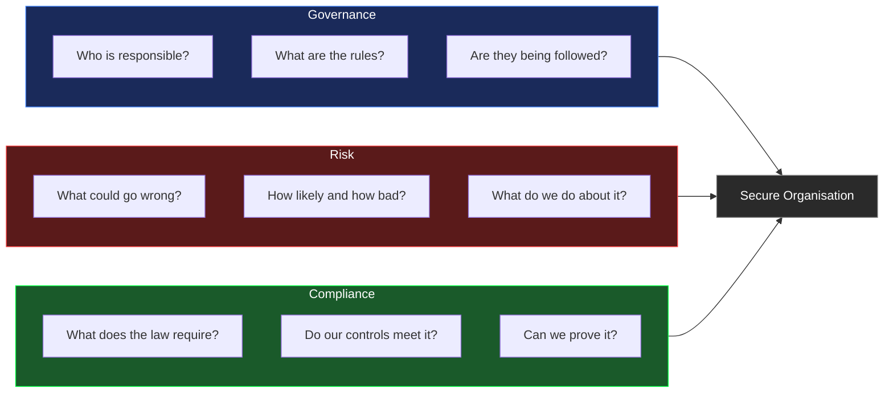
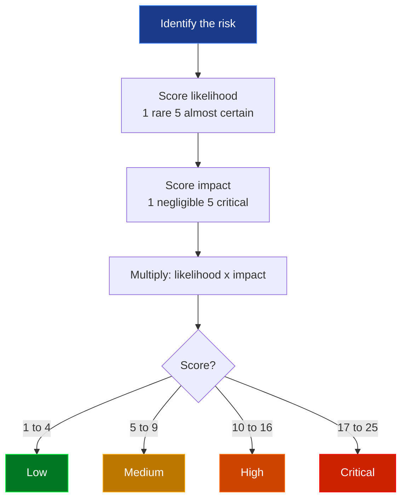
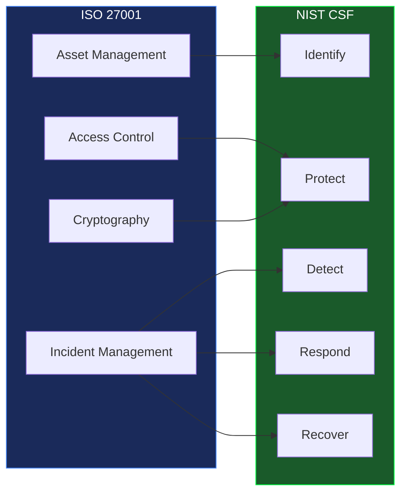

<div align="center">


<br/>


</div>

---

## Interactive learning site

<div align="center">

[](https://speed-boo3.github.io/grc-project/explain/)

</div>

Five interactive modules. Try the live risk scoring tool, explore compliance frameworks, build a security policy from scratch and work through a real ISO 27001 checklist.

---

## Who this is for

This project is for students learning cybersecurity who want to understand what GRC work actually looks like. Every concept is explained from scratch, every tool has real output you can run yourself, and the `frameworks/` and `templates/` folders contain material you can use directly in your own studies.

GRC is one of the most in-demand areas in cybersecurity right now. Many students overlook it because it sounds like paperwork. It is not. A good GRC analyst is one of the most valuable people in any security team.

---

## What is GRC

GRC stands for **Governance, Risk and Compliance**. It is the strategic layer of cybersecurity.

While technical security work focuses on tools and attacks, GRC focuses on structure and accountability. It answers questions like: do we know what our actual risks are? Are our controls working? Can we prove it to an auditor? Are we compliant with GDPR, ISO 27001 or other regulations?



**Governance** means setting the rules. Security policies, roles, responsibilities and accountability. Without governance, security has no strategy behind it.

**Risk** means identifying what could go wrong and prioritising what to fix first. You score each risk by likelihood and impact, then multiply them to get a risk score.

**Compliance** means proving that your controls actually work. Not just having a policy that says the right thing, but being able to demonstrate it in an audit.

---

## Project structure

```
grc-project/
├── frameworks/
│   ├── iso-27001/       <- ISO 27001 explained for students
│   ├── nist-csf/        <- NIST CSF explained for students
│   └── nist-rmf/        <- NIST RMF explained for students
├── templates/
│   ├── risk-register-template.md      <- ready to use
│   ├── security-policy-template.md    <- ready to use
│   └── gap-analysis-template.md       <- ready to use
├── resources/
│   └── README.md        <- curated list of free books, training and certifications
├── grc/
│   ├── risk-assessment/
│   │   ├── risk_matrix.py       <- likelihood x impact scoring engine
│   │   └── sample_risks.json    <- 6 example risks to get started
│   ├── network-scan/
│   │   └── scanner.py           <- nmap wrapper with risk output
│   ├── policies/
│   │   └── security_policy.md  <- full policy example
│   └── compliance/
│       └── checklist.md        <- ISO 27001 and NIST CSF checklist
├── scripts/
│   └── generate_report.py      <- weekly report generator
├── reports/                    <- generated reports live here
├── tests/
│   ├── test_risk_matrix.py
│   └── test_scanner.py
└── .github/workflows/
    ├── tests.yml               <- runs on every push
    └── weekly-report.yml       <- Mon, Wed, Fri at 08:00 UTC
```

---

## The tools

### Risk Matrix `grc/risk-assessment/risk_matrix.py`

Scores risks using likelihood x impact. Both run from 1 to 5. Multiply them to get a score between 1 and 25. The output is sorted from most critical to least so you always know what needs attention first.

```bash
python grc/risk-assessment/risk_matrix.py --file grc/risk-assessment/sample_risks.json
```

```
Risk Assessment Report
======================================================================
ID         Risk                            Score   Level      Owner
----------------------------------------------------------------------
RISK-002   Phishing attack                  20     Critical   Security Team
RISK-001   Unpatched systems                20     Critical   IT Operations
RISK-005   SQL injection data breach        15     High       Dev Team
RISK-003   Insider threat                   10     High       HR / Security
RISK-004   DDoS attack                       9     Medium     Network Team
RISK-006   Lost or stolen laptop             6     Medium     IT Operations
```

Risk scoring at a glance:

```
Score  1 to 4    Low       Accept or monitor
Score  5 to 9    Medium    Fix within 90 days
Score  10 to 16  High      Fix within 30 days
Score  17 to 25  Critical  Fix immediately
```

### Network Scanner `grc/network-scan/scanner.py`

Finds open ports on a target and converts risky ones into structured risk entries. This is the tool that bridges the gap between what your security policy says and what your network actually looks like.

```bash
python grc/network-scan/scanner.py --target localhost --output network_risks.json
```

> Only scan systems you own or have written permission to test.

```
Network Scan Report
Target  : localhost
Open ports: 22, 80, 443, 3306 (mysql 8.0.32)

Risks identified: 1

  NET-3306   MySQL exposed on port 3306
    Reason   : Databases should not be publicly accessible
    Score    : 16   High
    Treatment: Restrict with firewall rules or close the port
```

Ports that automatically generate a High risk entry and why:

```
Port 21   FTP         credentials sent in plaintext
Port 23   Telnet      everything unencrypted, replaced by SSH in the 1990s
Port 25   SMTP        open relay lets attackers send spam through your server
Port 445  SMB         WannaCry ransomware spread globally through this port in 2017
Port 3389 RDP         constant brute force target, multiple critical CVEs
Port 3306 MySQL       databases must never be directly accessible from the internet
Port 5432 PostgreSQL  same as MySQL
Port 6379 Redis       often ships with no authentication by default
Port 27017 MongoDB    thousands of databases have been wiped by attackers exploiting this
Port 8080 HTTP Alt    dev servers often run here without TLS
```

### Compliance Checklist `grc/compliance/checklist.md`

A practical checklist covering ISO 27001 and NIST CSF controls. Work through it and score your coverage. A lower score means more gaps to address.

### Report Generator `scripts/generate_report.py`

Generates a markdown report with charts every Monday, Wednesday and Friday. Each report shows compliance score per area and risk distribution. All reports are in [`reports/`](./reports/README.md).

---

## Risk scoring explained



A phishing attack scores 20 because it is very likely (5) and has major impact (4). A lost laptop scores 6 because the impact is low if the laptop is encrypted.

---

## Frameworks covered

This project is built around two of the most important frameworks in GRC. Detailed explanations and links are in the `frameworks/` folder.



**ISO 27001** is the international standard for information security management. Organisations get certified by passing an external audit. Widely used across Europe and globally.

**NIST CSF** is the US framework for cybersecurity. Flexible and widely referenced in job descriptions. Version 2.0 was released in 2024.

Full explanations in `frameworks/iso-27001/`, `frameworks/nist-csf/` and `frameworks/nist-rmf/`.

---

## Templates for students

The `templates/` folder contains three ready-to-use documents:

**Risk Register Template** covers how to document and track risks, with the full scoring methodology explained.

**Security Policy Template** is a complete policy covering access control, patch management, data classification, incident reporting and physical security.

**Gap Analysis Template** lets you compare your current controls against ISO 27001 and NIST CSF requirements and build a remediation roadmap.

---

## Risk register CLI

Add, update and close risks directly from the terminal without editing JSON manually.

```bash
python grc/risk-assessment/risk_manager.py list
python grc/risk-assessment/risk_manager.py list --status open
python grc/risk-assessment/risk_manager.py add --title "Ransomware attack" --likelihood 4 --impact 5 --owner "Security Team"
python grc/risk-assessment/risk_manager.py update RISK-001 --likelihood 3
python grc/risk-assessment/risk_manager.py close RISK-006 --note "Laptop encryption enforced"
```

---

## Quickstart

```bash
git clone https://github.com/Speed-boo3/grc-project.git
cd grc-project
pip install -r requirements.txt
```

Score the example risks:
```bash
python grc/risk-assessment/risk_matrix.py --file grc/risk-assessment/sample_risks.json
```

Scan your own machine:
```bash
python grc/network-scan/scanner.py --target localhost --output network_risks.json
python grc/risk-assessment/risk_matrix.py --file network_risks.json
```

Run the tests:
```bash
pytest tests/ -v
```

---

## Test your knowledge

20 questions covering GRC fundamentals. Every question has a full explanation so you learn as you go.

<div align="center">

[](https://speed-boo3.github.io/grc-project/quiz/)

</div>

---

## Free resources

Everything in `resources/README.md` is free. It includes:

- NIST SP 800-30 (risk assessment guide)
- NIST SP 800-53 (security controls catalogue)
- NIST CSF 2.0 full document
- ENISA guidance
- Free training from NIST and CISA
- Certification roadmap for GRC careers

<div align="center">

</div>
