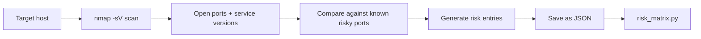

# Network Scanner

This tool scans a host for open ports and turns the findings into GRC risks. It is designed to bridge the gap between technical findings and the risk register.

---

## What it does



---

## Port risk levels explained

| Port | Service | Why it is risky |
|------|---------|-----------------|
| 21 | FTP | Sends data and passwords in plaintext |
| 23 | Telnet | Everything sent in plaintext, no encryption |
| 25 | SMTP | Open relay allows spam and spoofing |
| 445 | SMB | Primary vector for ransomware like WannaCry |
| 3389 | RDP | Constantly targeted by brute force attacks |
| 3306 | MySQL | Databases should never be publicly exposed |
| 5432 | PostgreSQL | Same as MySQL |
| 6379 | Redis | Often runs with no authentication by default |
| 27017 | MongoDB | Many breaches caused by exposed MongoDB instances |
| 8080 | HTTP Alt | Dev servers often run here without TLS |

Ports 22, 80 and 443 are considered expected and are not flagged.

---

## Usage

Safe test on your own machine:
```bash
python scanner.py --target localhost
```

Save risks to JSON:
```bash
python scanner.py --target localhost --output network_risks.json
```

Feed results into the risk matrix:
```bash
python ../risk-assessment/risk_matrix.py --file network_risks.json
```

---

## Legal and ethical notice

Only use this tool on systems you own or have written permission to test. Scanning networks without permission is illegal in most countries. In a real GRC engagement, scanning is always done under a signed scope agreement.
