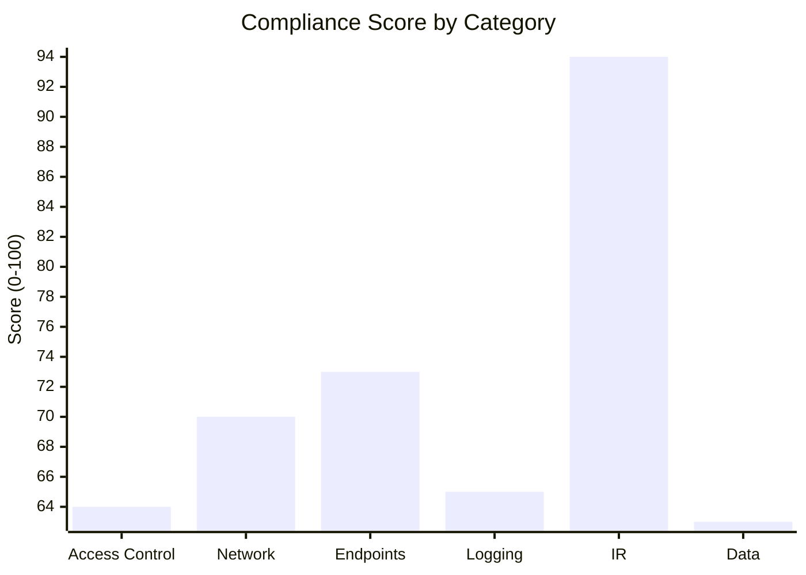
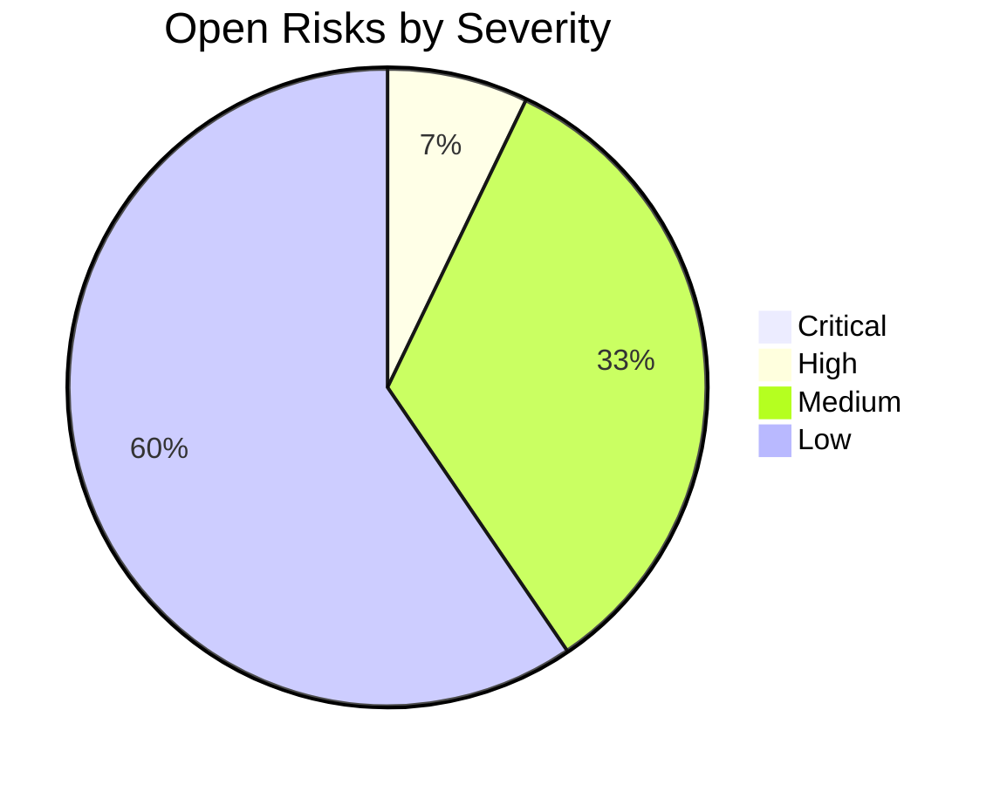
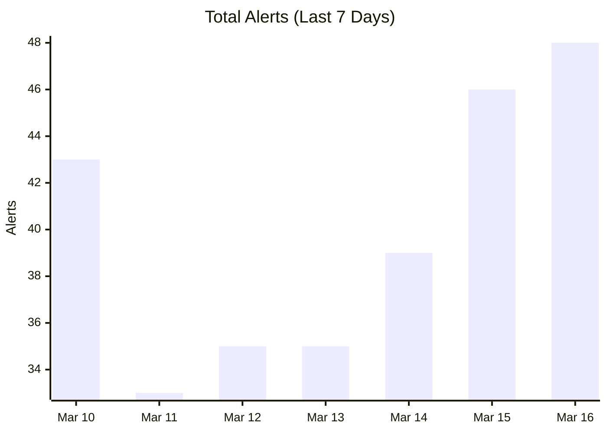
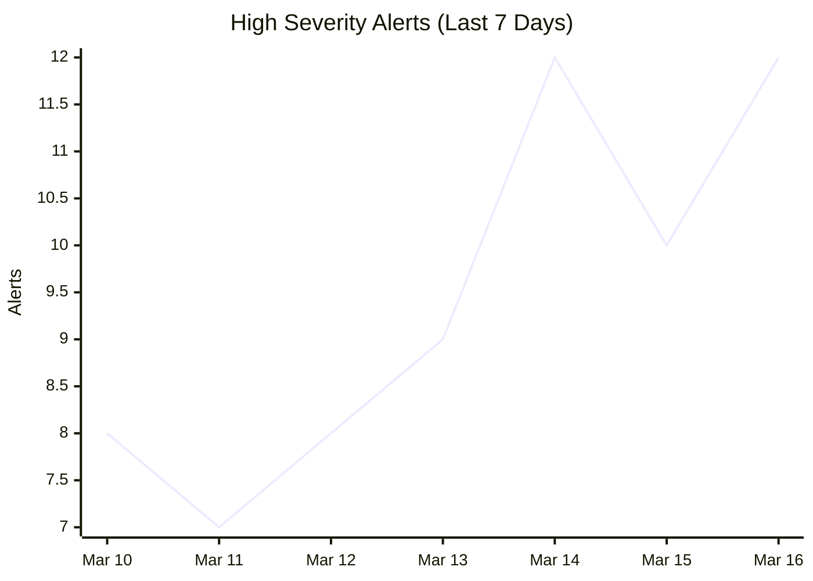
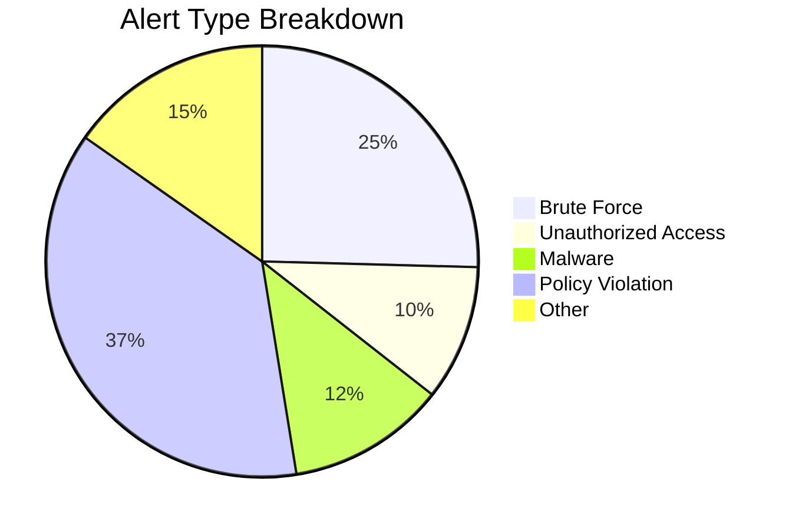

# Security Report — 2026-03-16

Weekly security report covering GRC compliance status and SOC activity for the past 7 days.

---

## Summary

| | |
|---|---|
| Avg compliance score | 72% |
| Open risks | 42 |
| Critical risks | 0 |
| Total alerts (7 days) | 279 |
| High severity alerts | 66 |

---

## Compliance

### Score by control area

### Open risks by severity

---

## SOC activity

### Alert volume

### High severity trend

### Alert types

---

## Notes

Numbers are based on internal assessments and log data. A drop in compliance score should trigger a review of the relevant control area.
